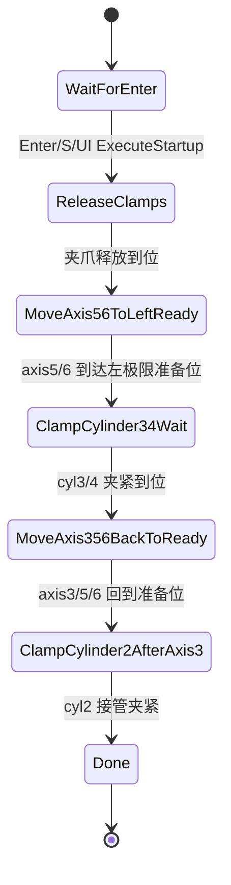

# C++ 上位机项目代码说明

本文档是 **C++ 主控（`ADS.vcxproj`）+ C# 可视化（`AdsControlUI`）** 双进程上位机的导读，重点解释**模块边界、数据流、状态机与扩展点**。API 细节请直接阅读对应头文件；本文档只在必要处给出 `path:line` 索引。

> 相关姊妹文档：[力反馈说明.md](力反馈说明.md)（力链路细节）、[RUNTIME_CALIBRATION_DECOUPLING_PARAMETERS.md](RUNTIME_CALIBRATION_DECOUPLING_PARAMETERS.md)（标定参数）。

---

## 1. 工程总览

| 子项目 | 类型 | 责任 |
|---|---|---|
| `ADS.vcxproj`（项目根目录） | C++ 控制台 x64 | 主控环，对接 PLC（ADS）、外部力 DAQ（TCP/Modbus）、双手柄 SDK（FLCatheter），并通过命名管道把状态推给 UI、把命令拉回来 |
| `AdsControlUI/AdsControlUI.csproj` | WPF .NET Framework 4.7.2 x64 | 操作员可视化与控制面板，命名管道客户端 |

**通信关系**

```
            FLCatheter SDK
                  │ poll/setforce_axis
                  ▼
   ┌────────────────────────────┐         pipe (\\.\pipe\ADS_Control_Vis)
   │       ADS.exe (C++)         │ ◀─── VisCommand ──── AdsControlUI.exe (C#)
   │  ┌──────────────────────┐   │ ────  VisState   ──▶
   │  │ main loop @ ~SDK rate│   │
   │  └─┬──────┬────────┬────┘   │
   │    │      │        │        │
   │    ▼      ▼        ▼        │
   │  ADS   TCP DAQ  ForceLogger │
   │   │     │         │         │
   └───┼─────┼─────────┼─────────┘
       ▼     ▼         ▼
     PLC   传感器     CSV 落盘
```

**目录约定**

- 工程根：`ADS.sln`、`ADS.vcxproj`、所有 C++ 源、FLCatheter.dll、`Force_sensor_*.csv` 历史日志
- 子目录 `手柄/`：FLCatheter 头文件与 lib，包装类 `Handle`
- 子目录 `ADS/`：TwinCAT ADS 头文件与 lib
- 子目录 `AdsControlUI/`：C# WPF 工程
- `x64/Debug` 与 `x64/Release`：构建输出（与 FLCatheter.dll 同目录运行）

---

## 2. 启动流程

`int main()` 在 [main.cpp:24](main.cpp) 起步，按下列顺序初始化：

1. UTF-8 控制台（解决中文输出乱码）
2. 命令行子模式分发：`--buttons/--btn`（[main.cpp:41](main.cpp:41)）打印手柄按键、`--monitor/--mon`（[main.cpp:94](main.cpp:94)）打印姿态；正常模式继续
3. 打开 ADS：先 `OpenComm_inside()`（本地路由），失败回退 `OpenComm()`（远端 NetId `169.254.119.135.1.1:851`），见 [main.cpp:228-246](main.cpp:228)
4. 打开双手柄（FLCatheter SDK）：导管手柄 SN=582，导丝手柄 SN=587，第一只手柄触发 `startServoLoop`
5. 启动 TCP DAQ 客户端（`TcpForceDaqClient::start("192.168.1.30", 502, local_ip)`）
6. 启动 `ForceLogger` 高频 CSV 写盘（writer 线程）
7. 启动 `VisServer` 命名管道服务（接受 C# 客户端）
8. 进入主循环 [main.cpp:703](main.cpp:703) `while(true)`

> **注意**：主循环无 `break` 出口、无 `SetConsoleCtrlHandler`，[main.cpp:2641-2649](main.cpp:2641) 的清理代码当前不可达。程序靠控制台关闭/Ctrl+C 强退；扩展时若需"自动结束"，应自加退出标志位。

---

## 3. 主循环节拍模型与"周期采样"机制

主循环 **没有 `Sleep`**，节拍由两件事自然限定：

1. `axis1_input_handle->poll()`（FLCatheter SDK 同步读，[main.cpp:706-714](main.cpp:706)）—— 跟随 SDK 伺服循环速率（`getServoLoopRate()` 报告）
2. ADS 批量读 / 单点写本身的阻塞耗时

实测节拍即"SDK + ADS IO 等待"之和，单循环约一到数毫秒；下游所有"按周期"行为都用 `loop_count % N` 分频：

| 周期 | 行为 | 位置 |
|---|---|---|
| 每拍 | `read_plc_state` / `write_refer` / 4 气缸 ADSWrite / `axis1_fast_return` / `axis6_fast_retract` / `startup_smoothing_bypass` | [main.cpp:1271/2166/2200-2206/2262-2264](main.cpp:1271) |
| 每 5 拍 | `act_pos_from_left` / `refer_from_left` 读取 | [main.cpp:732](main.cpp:732) |
| 每 10 拍 | `estop_hold_req` 读取 | [main.cpp:909](main.cpp:909) |
| 每 20 拍 | axis4 manual 诊断 | [main.cpp:2172](main.cpp:2172) |
| 每 50 拍 | `self_check_done` / `handle_reinit_req` 状态读取 | [main.cpp:1172](main.cpp:1172) |
| `should_sample_force` 触发时 | 力采样 + 标定 + 反馈调度 | [main.cpp:2269](main.cpp:2269) |

`should_sample_force` 的判定：`cfg.force_log_period_ms == 0`（默认）时每拍采，否则按毫秒节拍触发（`ControlConfig::force_log_period_ms`，[control_types.h:155](control_types.h:155)）。**注意：旧 `ForceLogState` 文本日志已停用，"周期采样"现在只控制力反馈调度，不直接落盘**——落盘走 `ForceLogger` 异步线程。

---

## 4. ADS 通信模型

封装类 `CADSComm`（[ADSComm.cpp](ADSComm.cpp)）。设计要点：

- **句柄缓存**：`unordered_map<symbol, handle>` 在 `ADSGetAddr` 内 lazy 建立；批量读用 `ADSIGRP_SUMUP_READ`（[ADSComm.cpp:91-205](ADSComm.cpp:91)），单点读写走 `ADSIGRP_SYM_VALBYHND`
- **全部同步阻塞**：未启用 `AdsNotification`（异步事件），grep 工程无命中。主循环用"读 → 决策 → 写"的简单模型；这是当前节拍下可接受的折衷
- **关闭时**：`CloseComm` 一次性释放全部句柄（`ADSIGRP_SYM_RELEASEHND`，[ADSComm.cpp:374-378](ADSComm.cpp:374)）
- **路由优先级**：内部（本机 PLC）失败才尝试外部 NetId（[main.cpp:228-246](main.cpp:228)）

扩展时如需新增 PLC 变量：在 [plc_io.cpp:7-92](plc_io.cpp:7) `AdsSymbol` 命名空间里加 `const char*` 符号名，并在 `plc_io::*` 中加一个 API 函数；不要在 `main.cpp` 里直写符号字符串。

---

## 5. PLC 变量字典

按用途分组（详见 [plc_io.cpp:7-92](plc_io.cpp:7)）：

| 组 | 变量 | 类型 | 说明 |
|---|---|---|---|
| 位置（读 / 写） | `G.refer` (写)、`G.Act_pos` (读)、`G.init_pos`、`G.leftlimit`、`G.act_pos_from_left`、`G.refer_from_left`、`G.v_limit` | 7×double | 7 轴位置/限速 |
| 气缸（写） | `G.cylinder1_value` ~ `G.cylinder4_value` | unsigned short | 导管/导丝两对夹爪 PWM 量 |
| 气缸 5（写 + 读） | `G.cylinder5_cmd / press_req / value` | mixed | 由 582 b6 在正式控制阶段切换 |
| 自检握手 | `G.self_check_done`、`G.handle_reinit_req`、`G.estop_hold_req`、`G.gen_state` | bool/int | 启动握手与急停 hold |
| 力（PLC 侧 ADS fallback） | `G.ft_1_value`、`G.fn_1_value`、`G.fn_2_value`、`G.ft_2_value` | INT16 | TCP DAQ 失败时的备用通道 |
| 平滑旁路 | `G.axis1_fast_return`、`G.axis6_fast_retract`、`G.startup_smoothing_bypass` | bool | 给 PLC 端的平滑器关阀门 |
| axis4 手动 | `G.axis4_fwd_req / rev_req / manual_busy / error / error_id` | bool/int | 手动点动协议 |
| 计划回退（每轴一组） | `AdsSymbol::axis1_return / axis3_return / axis5_return / axis6_return` | `AxisReturnAdsSymbols`（Req/Busy/Done/Error/ErrorId/TargetAbs/Velocity/Acc/Dec/Jerk） | 由 PLC 内部规划完成的快速移动 |

**没有显式 `clutch/brake/engage` 信号**——器械换手在 PLC/上位机侧由 `cylinder1~4` 的 `staggered_pair` 与计划回退共同实现。

---

## 6. 运动子系统

三个并存的运动通道，按从粗到细：

### 6.1 `sync_all(divisor)`
位置同步层（`motion_sync.cpp`）。把所有轴的 `refer` 朝 `Act_pos` 收敛或反向同步，启动/急停恢复后用一两拍 `sync_all(20)` 把基线对齐。

### 6.2 `plc_io::request_axis_return(...)`
**计划回退**——由 PLC 内部按 Velocity/Acc/Dec/Jerk 规划路径执行单轴大位移；上位机只下发请求，监 `read_axis_return_status` 的 `Busy/Done/Error`。新的"力过渡实验"状态机就用它来做"快速回退到起点"。

### 6.3 `CrawlState::Phase` 状态机
轴爬行/快退（[control_types.h:218-226](control_types.h:218)）：

```
Follow → SwitchWait → FastMove → SettleHold → ClampWait → RestoreWait → Follow
```

- `Follow`：手柄直接映射到 axis refer（窗口内激活）
- `SwitchWait`：到边界，准备切夹爪
- `FastMove`：`request_axis_return` 已下发，等 PLC `Done`
- `SettleHold`：回退后短暂等待，传感器稳定
- `ClampWait`：`staggered_pair` 切换夹爪对（必须错峰）
- `RestoreWait`：v_limit 与基线重新建立，回到 `Follow`

axis1 段内联在 [main.cpp:1858-2109](main.cpp:1858)，axis6 段在 [main.cpp:1382-1536](main.cpp:1382)。

### 6.4 错峰切缸 `staggered_pair`
[main.cpp:1351-1361/1439-1466/1839-1908](main.cpp) 内联多次：保证"释放夹爪关闭"与"接管夹爪打开"不同周期下发，避免器械瞬时无约束。

---

## 7. 启动序列状态机

`StartupPhase`（[control_types.h:203-212](control_types.h:203)）：



驱动逻辑在 [main.cpp:1538-1672](main.cpp:1538)，工厂代码在 [startup_sequence.cpp](startup_sequence.cpp)。**模板复用价值**：任何"按按钮 → 定长流程 → 自动收尾"的自动化操作都应仿照此处的 `phase + 退出条件` 写法（力过渡实验状态机即采用此模式）。

UI 入口 `VisCommandType::ExecuteStartup`（[main.cpp:2584-2613](main.cpp:2584)）与 C# `SendStartupParams`（[AdsControlViewModel.cs:226-236](AdsControlUI/AdsControlViewModel.cs:226)）。

---

## 8. 力反馈数据流

```
TCP DAQ worker ──┐                     ┌── ForceLogger (writer thread)
                 │ latest_v_[6]        │
                 ▼                     │
主循环抓帧 → ForceSampleFrame ────┐    │
                                  ▼    │
                  calibrate_force(...) ┘
                          │
                          ▼ (CalibratedForce)
                  process_force_feedback(...)
                          │
                          ▼
            Handle::setforce_axis(F, axis=1, N)
                          │
                          ▼
            FLCatheter SDK ── 双手柄物理输出
```

**关键模块**：

- `tcp_force_daq.cpp` worker（[tcp_force_daq.cpp:140-241](tcp_force_daq.cpp:140)）：Modbus-TCP 查询 → 25 字节响应 → 6 路 INT16 → `voltage = raw/1000.0` → 写 `latest_v_[6]`
- `calibrate_force`（[force_calibration.h:47-106](force_calibration.h:47)）：零点扣除 → 重力补偿（可选）→ axial_k/torque_k 线性标定 → 解耦旁路 → 主端扭矩归一化 → 死区 → 限幅
- `process_force_feedback`（[force_feedback.cpp:3-107](force_feedback.cpp:3)、签名见 [force_feedback.h](force_feedback.h)）：
  - 输出闸：`enabled && control_active && !freeze_active && !estop_hold_active && cal_zeroed && sample.valid`
  - **导丝模式 582 强制 0**（仅导管模式才下发力反馈到 582 手柄）
  - **快退冻结**：`axis1_fast_return || axis6_fast_retract` 为 true 时，首拍锁存 `theory_582_f/n` 到 `freeze_582_*`，整段快退用锁存值
  - 587（导丝手柄）当前始终写 0

**为什么 587 强 0**：导丝侧标定/解耦尚未完成；现阶段只用于推送，不做力反射（参考 [力反馈说明.md](力反馈说明.md) §4）。

**快退冻结机制的副作用**：从冻结到恢复是**硬切换**，操作者可能感到顿挫。未来"跨力盲窗平滑力交接"将在这里替换为线性/曲线插值——这就是论文 §3 组件二与 §6.1 决定性预实验关心的入口。

---

## 9. ForceLogger 高频 CSV 架构

[force_logger.h](force_logger.h) / [force_logger.cpp](force_logger.cpp)。

- **SPSC 环形队列**：`std::vector<Row> ring_`，容量 4096（`kCapacity`）
- **入队点**：DAQ worker 在解析出每帧后，调 `on_sensor_sample(tick_ms, v[6])`
- **轴位置补齐**：主线程每拍调 `publish_axis_snapshot(a1, a2, a6, a7)`，DAQ 入队时读 `std::atomic<double>` 取值（避免锁）
- **零点补齐**：调零或开始记录时，主线程调 `publish_force_zero(fn_zero_v, ft_zero_v)`
- **writer 线程**：`writer_loop()` 每 64 行 flush 一次；停止时写完队列残余后关闭文件
- **文件名**：`Force_sensor_YYYYMMDD_HHMMSS.csv`，写入当前工作目录
- **列**：`tick_ms, axis1_pos_abs_mm, axis2_pos_abs_mm, fn_1_raw_v, ft_1_raw_v, fn_1_zero_v, ft_1_zero_v`

**扩展接入点**：新的实验型 logger（如 `ForceTransitionLogger`）应复用同样的 SPSC + writer 模板，不要在主线程做 IO。

---

## 10. Vis 协议（命名管道）

管道名 `\\.\pipe\ADS_Control_Vis`，message 模式，单实例。

### 10.1 下行 `VisState`（C++ → C#）

定义在 [vis_server.h:11-44](vis_server.h:11)，C# 镜像 [VisProtocol.cs:5-42](AdsControlUI/VisProtocol.cs:5)。`#pragma pack(1)` 二进制布局，**两侧字段顺序必须严格一致**。

每拍 `VisServer::push_state` 把最新快照写入内部缓冲（`state_dirty_=true`），server 线程发现 dirty 时才 `WriteFile` 推送，避免空转。

### 10.2 上行 `VisCommandType / VisCommand`（C# → C++）

定义在 [vis_server.h:47-72](vis_server.h:47)。当前 14 个命令字（0~13）。`VisCommand{type, param1, param2}` 固定 12 字节。

server 线程用 `PeekNamedPipe` 检查可读后 `ReadFile`，入 16 槽环形队列；主循环每拍 `vis_server.poll_command(cmd)` 消费，分发在 [main.cpp:2492-2636](main.cpp:2492)。

### 10.3 扩展规则

| 场景 | 做法 |
|---|---|
| 新增观测字段 | 末尾追加，两侧同步；`Marshal.SizeOf<VisState>()` 自动重算，C# `VisPipeClient` 无需改 |
| 新增命令 | 末尾追加枚举值（不要复用废弃的 `RequestModeSwitch=3`） |
| 复杂参数下发 | 复用 `SendStartupParams` 模式：fixed-point ×1000 / ×100000，多条命令依次灌入 C++ 缓冲区，最后一条触发执行 |

---

## 11. C# 上位机交互

### 11.1 数据流

```
VisPipeClient (后台读线程)
        │ Marshal.PtrToStructure<VisState>
        ▼
AdsControlViewModel._state
        │ DispatcherTimer 33ms (≈30 Hz)
        ▼
   OnPropertyChanged × N    ─────►   XAML 绑定（指示灯/进度条/文本）
        │
        └── event StateUpdated ─────►   MainWindow.Vm_StateUpdated
                                              │
                                              ├── _forceWindow?.AddState(state)
                                              └── (将来) _ftExpWindow?.OnState(state)
```

### 11.2 关键文件

- [AdsControlViewModel.cs](AdsControlUI/AdsControlViewModel.cs)：唯一 VM，公开方法形式的命令（无 ICommand），属性按"连接 / 模式 / 力反馈 / PLC 轴 / 状态"分组
- [MainWindow.xaml(.cs)](AdsControlUI/MainWindow.xaml)：单窗口，4 个 GroupBox（电缸、模式、力反馈、启动准备）
- [ForceRealtimeWindow.xaml(.cs)](AdsControlUI/ForceRealtimeWindow.xaml)：弹出窗口，自绘 Canvas+Polyline 滚动绘制 30 s 的 4 路力曲线
- [VisProtocol.cs](AdsControlUI/VisProtocol.cs)：C 风格 P/Invoke 布局，与 C++ `vis_server.h` 一一对应
- [VisPipeClient.cs](AdsControlUI/VisPipeClient.cs)：连 `ADS_Control_Vis`，断线 500 ms 重连，`SendCommand` 同步阻塞写

### 11.3 没有的东西

- 无 ICommand / RelayCommand（点击事件直接在 `xaml.cs` 调 VM 方法）
- 无 NuGet 依赖（绘图自绘；新窗口若需复杂图表，引入 ScottPlot.WPF 等）
- 无 CSV 写入 / SaveFileDialog（数据落盘全在 C++ 端 ForceLogger 完成）

---

## 12. 现有"实验/录制"骨架与扩展接入点

### 12.1 现有可复用骨架

| 骨架 | 位置 | 适用场景 |
|---|---|---|
| 启动序列 `StartupPhase` | [control_types.h:203-212](control_types.h:203) + [main.cpp:1538-1672](main.cpp:1538) + [startup_sequence.cpp](startup_sequence.cpp) | "按按钮 → phase 推进 → PLC 反馈驱动 → 自动收尾" |
| 轴爬行/快退 `CrawlState::Phase` | [control_types.h:214-249](control_types.h:214) + [main.cpp:1382-1536/1858-2109](main.cpp:1382) | "边界触发 → 快速回退 → 重建基线" |
| 错峰切缸 `staggered_pair` | [main.cpp:1351-1361/1439-1466/1839-1908](main.cpp) | "互锁夹爪对的安全切换" |
| 计划回退 API | `plc_io::request_axis_return / read_axis_return_status / clear_axis_return_request`（[plc_io.h:58-67](plc_io.h:58)） | "下发目标位置+动力学参数，PLC 自动规划" |
| 异步 CSV 日志 | `ForceLogger` SPSC + writer 线程（[force_logger.h:14-66](force_logger.h:14)） | "高频数据落盘，零拷主线程" |
| 参数 fixed-point 下发 | `SendStartupParams`（[AdsControlViewModel.cs:226-236](AdsControlUI/AdsControlViewModel.cs:226)） | "UI 表单 → 多命令灌参 → 一条触发" |

### 12.2 第一例扩展：力过渡决定性预实验

正在按 [d-work-files-vessel-intervention-robot-composed-barto.md](C:/Users/Sui/.claude/plans/d-work-files-vessel-intervention-robot-composed-barto.md) 实施：

- 新增 `force_transition_experiment.h/.cpp`（沿用 §12.1 启动序列骨架）
- 新增 `force_transition_logger.h/.cpp`（沿用 §12.1 ForceLogger 骨架）
- Vis 协议追加 8 个 `ft_exp_*` 状态字段 + 4 个新命令枚举（沿用 §10.3 扩展规则）
- C# 新增 `ForceTransitionWindow`（沿用 §11.1 数据分发链，引入 ScottPlot.WPF 画双视图）

**接入点位置**：

- C++ 主循环：在 `process_force_feedback` 之前插入 `ft_exp.tick(...)`；`ft_exp.active()` 时由实验状态机接管 `refer[0]`
- C++ 命令分发：在 [main.cpp:2492-2636](main.cpp:2492) switch 末尾追加新 case
- C++ VisState 写入：在 [main.cpp:2449-2488](main.cpp:2449) 段末尾追加 `ft_exp_*` 字段填充
- C# UI：MainWindow 力反馈 GroupBox 增加"力过渡实验"按钮，沿用 `ShowForce_Click` 模式弹出独立窗口

### 12.3 扩展时的安全清单

- [ ] PLC 写出动作前确认 `control_active && !estop_hold_active && cal_zeroed`
- [ ] 任何"接管 axis refer"的状态机退出时调 `clear_axis*_return_requests` 与还原 `v_limit`
- [ ] 新增 VisState 字段后两侧打印 `sizeof(VisState)` 比对
- [ ] 新增命令字仅末尾追加，禁止复用废弃枚举（如 `RequestModeSwitch=3`）
- [ ] 新增 CSV 落盘走异步 writer 线程，主线程零 IO
- [ ] 实验/自动化逻辑遇 `EstopHold / freeze_active / cal_zeroed=false` 边沿 → 立即 abort + 安全收尾
